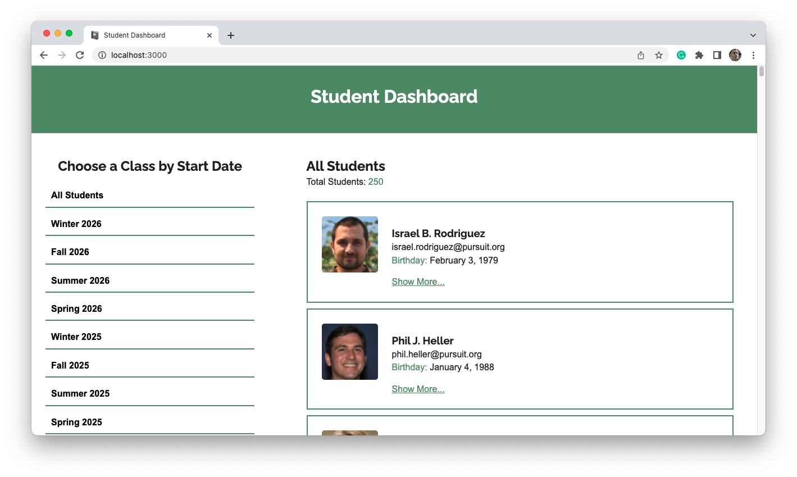
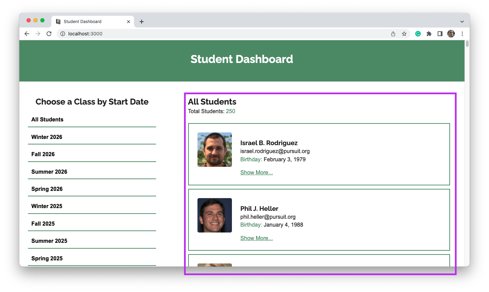
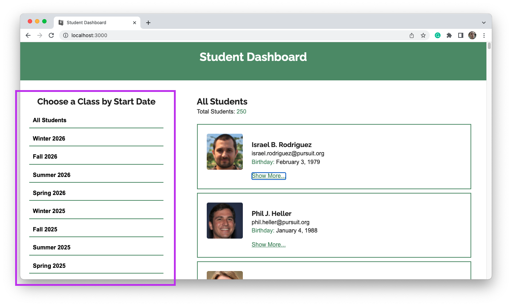
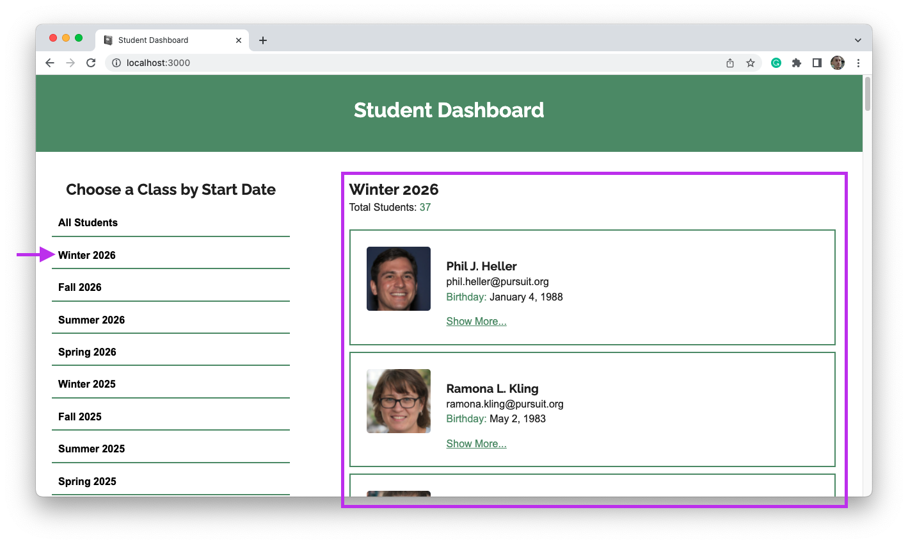
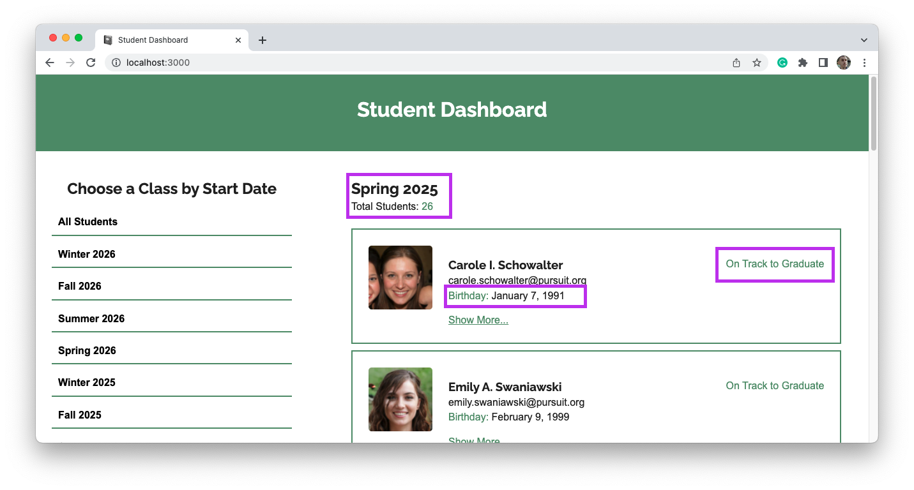
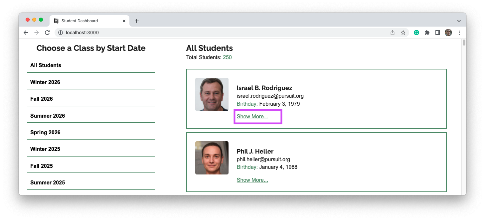
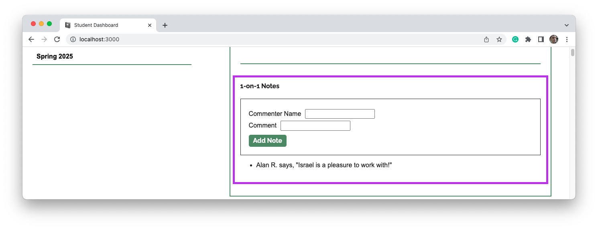

# React Mid-Module Project



For this assignment, you will build a student dashboard that will make use of some randomized data. The dashboard should show easy to understand data, formatted in a way that is easy for a user to use.

There are 10 total features that can be created. Each completed feature will be worth 1 point. A minimum of 7 points must be attained in order to pass this project. You may receive partial credit (0.5) points for a feature that is partially complete.

## Project setup

### Getting started

1. Fork and clone this repository.

1. Navigate to the cloned repository's directory on your command line. Then, run the following command:

```
npm install
```

1. Note the `data` folder inside `src` - this will have the data for this project

### Tests

There are no tests as part of this project. Instead, focus on making sure features work by testing them through your own application.

## Existing code

This project includes some existing code which will help you complete the features below.

- [`src/data/data.json`](./src/data/data.json): This contains data for over 200 students. Each student multiple properties associated with them. Some important ones include:
  - `id`: A unique ID associated with each student.
  - `profilePhoto`: A randomly generated photo from [fakerface.rest](https://fakerface.rest).
  - `cohort`: An object represent which "cohort" the student is in.

## Features

Each of the features below will count as 1 point towards your overall score. While there is a styled website to serve as a reference, you are not required to style the page unless the feature specifically asks you to do so.

_Take careful note of the requirements._ Sometimes an image will show slightly more or slightly less than what you need to score the point.

### ✩ Student list (1 point)



Create a list of students that displays when you arrive on the page. At the top of this list, should be the following:

- A title, such as "All Students".
- A count of how many students there are.

Each student shown on the list should include the following:

- The student's name.
- The student's username, which is their email.
- The student's profile photo.

### ✩ Cohort list (1 point)



Create a list of cohorts based on the data you have available. To complete this feature, the following must be true:

- There is a title at the top of the list. (e.g. "Choose a Class by Start Date".)
- The list contains "All Students" as the first item.
- The cohorts listed are unique. That is, "Winter2026" does not appear more than once.

> **Tip:** Each student has a `cohort` key which contains an object with a `cohortCode` key. That `cohortCode` key is shared by all cohorts with the same start date.

### ✩ Sorted and formatted cohort list (1 point)

Update your cohort list so that the following is true:

- Each cohort has a "human readable" name instead of the cohort code. (e.g. "Winter 2026" instead of "Winter2026".)
- The cohorts are organized by date, either in ascending or descending order. "All Students" should remain at the top.

### ✩ Interactive cohort list (1 point)



Update your cohort list so that when any of the cohorts are clicked the student list updates to only show students in that cohort. To complete this feature, the following must be true:

- When you click on any of the cohorts in the cohort list, the view on the right only shows students from that list.
- The student list title changes. (e.g. From "All Students" to "Winter 2026".)
- The student count changes. (e.g. From "250" to "37".)
- When you click on "All Students", all of the students are shown once again.

### ✩ Improved student list (1 point)



Update your interactive student list so that the following is true:

- The title is always in a human readable format. (e.g. "All Students" or "Winter 2026" instead of "Winter2026".)
- The student's birthday is visible underneath their username.
- The student is shown on "On Track to Graduate" if the following is true:
  - The student has a resume certification (e.g. `certifications.resume` is `true`).
  - The student has a LinkedIn certification (e.g. `certifications.linkedin` is `true`).
  - The student has a GitHub certification (e.g. `certifications.github` is `true`).
  - The student has a mock interview certification (e.g. `certifications.mockInterview` is `true`).
  - The student has a current CodeWars score that is over 600.

> **Tip:** Working with dates can be difficult! Consider viewing the documentation on [Dates](https://developer.mozilla.org/en-US/docs/Web/JavaScript/Reference/Global_Objects/Date) as well as the documentation on the [`Intl.DateTimeFormat()` constructor](https://developer.mozilla.org/en-US/docs/Web/JavaScript/Reference/Global_Objects/Intl/DateTimeFormat/DateTimeFormat).

### ✩ Additional student details (1 point)



Add a button to each student that, when clicked, displays more information about the student.


To complete this feature, the following should be true:

- The text of the button changes depending on whether it is open or closed.
- Opening the details section for one student does not open it for every other student.
- The details section includes current CodeWars details. You may decide what to show here and how to present it.
- The details section includes the percentages for all scores, properly formatted as percentages.
- The details section includes whether or not the student has received certain certifications.

### ✩ Improved student details (1 point)

Update the student details section so that the following is true:

- A percentage is shown for the student's CodeWars points that compares their current total to the goal total.
  - If it is equal to or greater than 100%, the percentage is shown as green.
  - If it is between 50% and 100%, the percentage is shown as yellow.
  - If it is less than 50%, the percentage is shown as red.
- Instead of showing "true" or "false" for certifications, show an emoji or icon depending on the certification status.

### ✩ 1-on-1 section (1 point)



Create a section in the student details section that contains information about a student's 1-on-1 with an instructor. To complete this feature, the following should be true:

- The section should include a title. (e.g. "1-on-1 Notes".)
- The section should include a form with commenter name, comment, and a submit button.
- The section should show a list of all previous notes that have been added.

### ✩ Interactive 1-on-1 section (1 point)

Improve the 1-on-1 section with a working form. To complete this feature, the following should be true:

- The form can be filled out and submitted. On submit, the inputs are cleared.
- The submitted information is immediately shown in the list of notes.
- While the notes will not persist if the page is loaded, the new notes _should_ be found if you interact with a new cohort in the cohort list and then find the student.

### ✩ Style your application (1 point)

Improve the look and feel of your application by styling all components. To complete this feature, the following should be true:

- Your application should include appropriate spacing, font sizes, and layout.
- You make use of CSS Grid for at least one section of your application.
- You make use of the `:hover` pseudo-class on at least one element.

## Advice

When building a project, there are additional skills to be gained alongside the tech you are learning. In this project, your ability to do the following will be tested:

- To plan out your approach to large project before coding
- To break large features into small, testable tasks that you can build
- To synthesize multiple skills you've learned at once
- To learn new skills and syntax on your own
- To manage your time and stay focused on the important tasks
- To ask for help

Without a good strategy, React can be very difficult. Consider reading the following before getting started:

- [ReactJS: Thinking in React](https://reactjs.org/docs/thinking-in-react.html)

### Suggested process

Consider the following process as a baseline for working through this project:

1. Start by sketching out the application on a piece of paper or online. Think about what the component hierarchy will be before you just start building.
1. Build a static, non-interactive, and non-styled version of the application first. For example, start by listing all of the student names on the page.
1. Once you have information displayed on the page, pick one component to work on to make more interactive.

Continue to slowly iterate, making small changes to complete each feature. Commit often, so that you can always undo your changes if you break something big.
